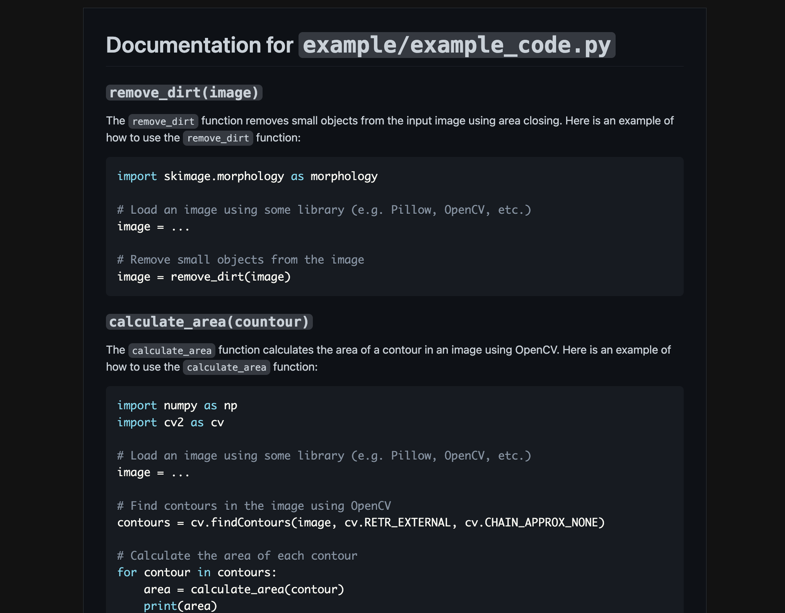

# docugen

Generating documentation using OpenAI LLMs

[Example input](example/example_code.py)

[Example output](example/example_code-doc.md)

## Spec

- Connecting to ChatGPT with [revChatGPT](https://github.com/acheong08/ChatGPT)
- Currently only supports Python source code & extracts top-level functions only
